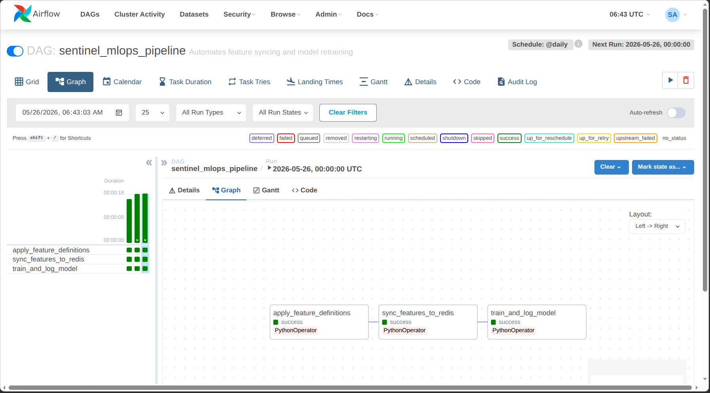
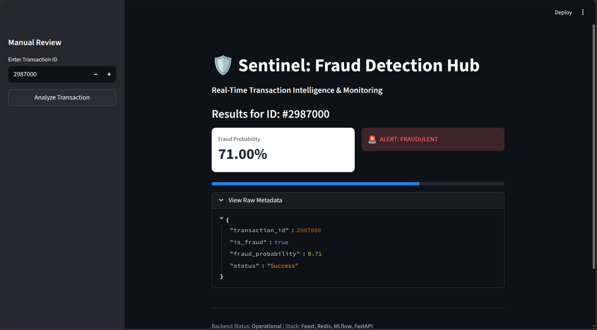
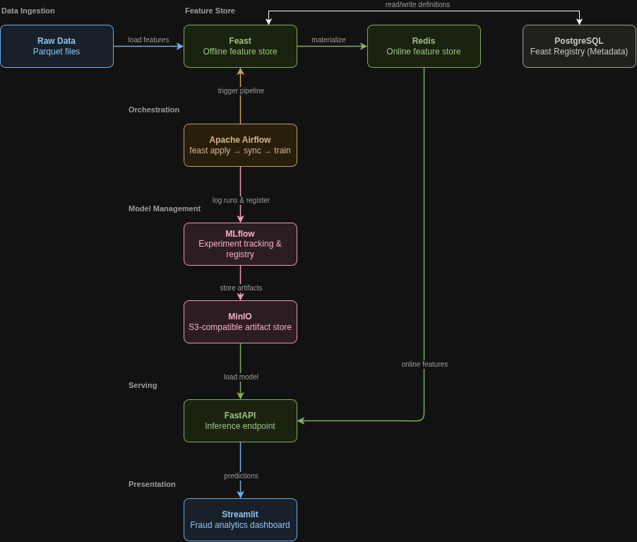

# Sentinel: Real-time Fraud Detection MLOps Platform

[](https://www.python.org/downloads/release/python-3100/)
[](https://docs.docker.com/compose/)
[](https://opensource.org/licenses/MIT)

> A production-grade end-to-end MLOps platform for real-time fraud detection with automated feature engineering, model training, and serving infrastructure.

---

 


## Table of Contents

- [Overview](#overview)
- [Architecture](#architecture)
- [Tech Stack](#tech-stack)
- [Project Status](#project-status)
- [Quick Start](#quick-start)
- [Project Structure](#project-structure)
- [Features](#features)
- [API Endpoints](#api-endpoints)
- [Development](#development)
- [Roadmap](#roadmap)
- [Troubleshooting](#troubleshooting)
- [Contributing](#contributing)
- [License](#license)

---

## Overview

Sentinel is a complete MLOps platform that demonstrates production-level machine learning infrastructure for fraud detection. It showcases:

- **Automated ML Pipelines**: Daily model retraining orchestrated by Apache Airflow
- **Feature Store**: Feast-based feature management with offline (Parquet) and online (Redis) stores
- **Experiment Tracking**: MLflow for model versioning and metric tracking
- **Real-time Serving**: FastAPI endpoint serving sub-second predictions
- **Scalable Infrastructure**: Microservices architecture using Docker Compose

**Use Case**: Credit card transaction fraud detection with 50,000+ transactions

Read the full techical writeup on [medium](https://medium.com/@chidubemndukwe/beyond-the-notebook-architecting-a-real-time-mlops-platform-for-fraud-detection-38dbf523aec4)

---

## Architecture

### System Architecture



#### Legend

| Color | Layer | Components |
|-------|-------|------------|
| Blue | Data Ingestion & Presentation | Raw Data (Parquet), Streamlit Dashboard |
| Green | Feature Store & Serving | Feast, Redis, FastAPI |
| Amber | Orchestration | Apache Airflow |
| Pink/Rose | Model Management | MLflow, MinIO |
| Gray | Persistence | PostgreSQL |

## Tech Stack

| Component | Technology | Purpose |
|-----------|-----------|---------|
| **Orchestration** | Apache Airflow 2.7.1 | Workflow automation & scheduling |
| **Feature Store** | Feast 0.31.1 | Feature engineering & serving |
| **Experiment Tracking** | MLflow | Model versioning & metrics |
| **Object Storage** | MinIO | S3-compatible artifact storage |
| **Online Store** | Redis | Low-latency feature serving |
| **Database** | PostgreSQL 15 | Metadata persistence |
| **API** | FastAPI | Real-time prediction serving |
| **Dashboard** | Streamlit | Visualization & monitoring |
| **Infrastructure** | Docker Compose | Container orchestration |
| **ML Framework** | scikit-learn | Model training |

---

### Database Architecture: The Shared PostgreSQL Container (`sentinel_db`)

A common question when viewing the running containers is why the `sentinel_db` container is used, even if a logical database named "sentinel_db" isn't explicitly active. 

To conserve resources, we use a single PostgreSQL container (`sentinel_db`) as the central metadata backbone for the entire MLOps pipeline. During startup, the `init-db.sql` script dynamically provisions isolated logical databases inside this container for our core tools:

* **`airflow_db`**: Stores Apache Airflow's orchestration metadata (DAG definitions, task states, RBAC credentials).
* **`feast_registry`**: Acts as the central SQL registry for the Feast Feature Store, keeping the offline (Parquet) and online (Redis) stores synchronized.
* **MLflow Tracking**: Uses the primary Postgres database to track experiment runs, hyperparameters, and the model registry state.


## Project Status

### Working Features

- [x] **Infrastructure**: 9 Docker containers running in orchestrated network
- [x] **Feature Store**: Feast with PostgreSQL registry and Redis online store
- [x] **ML Pipeline**: Automated 3-stage Airflow DAG
  - Task 1: Apply feature definitions
  - Task 2: Smart materialization (full/incremental)
  - Task 3: Model training and MLflow logging
- [x] **Model Storage**: Artifacts persisted in MinIO
- [x] **API Serving**: FastAPI endpoint with health checks
- [x] **Feature Serving**: Real-time feature retrieval from Redis (~50K features)

### In Progress

- [ ] **Model Performance**: Baseline RandomForest (97.7% accuracy, needs tuning)
- [ ] **Monitoring**: Prometheus + Grafana integration
- [ ] **Testing**: Unit and integration test coverage
- [ ] **Documentation**: Comprehensive setup guide

### Known Limitations

- Model recall is 35% (needs hyperparameter tuning and feature engineering)
- No data drift detection yet
- Single model serving (no A/B testing)
- Manual bucket creation required (not automated in setup)

---

## Quick Start

### Prerequisites

- Docker Desktop (20.10+)
- Docker Compose (2.0+)
- Python 3.10+ (for local development)
- 8GB RAM minimum
- 20GB disk space

### Installation

**Automated Setup (Recommended)**
```bash
# Clone the repository
git clone https://github.com/Duks31/fraud-detection-platform.git
cd fraud-detection-platform

# Run automated setup
./setup.sh

# Wait for completion (~5 minutes)
# Follow on-screen instructions

# Tear down infrastructure when done
chmod +x teardown.sh
./teardown.sh
```
**Manual Setup**

1. **Clone the repository**
```bash
   git clone https://github.com/Duks31/fraud-detection-platform.git
   cd fraud-detection-platform
```

2. **Configure environment variables**
```bash
   cd infrastructure
   cp .env.example .env
   # Edit .env with your credentials (or use defaults for local dev)
```

3. **Start the infrastructure**
```bash
   docker compose up -d
```

   Wait ~60 seconds for all services to start. Verify:
```bash
   docker ps  # Should show 9 running containers
```

4. **Create MinIO bucket** (one-time setup)
```bash
   cd ..
   conda activate fdp  # or your virtual environment
   python create_bucket.py
```

5. **Trigger the ML pipeline**
   - Open Airflow UI: http://localhost:8080
   - Login: `admin` / `admin`
   - Enable and trigger DAG: `sentinel_mlops_pipeline`
   - Wait ~5-10 minutes for completion (all 3 tasks should turn green)

6. **Test the API**
```bash
   # Health check
   curl http://localhost:8000/health
   
   # Prediction
   curl http://localhost:8000/predict/2987000
   
   # Expected output:
   # {"transaction_id":2987000,"is_fraud":true,"fraud_probability":0.71,"status":"Success"}
```

---

## Project Structure
```
fraud-detection-platform/
├── airflow_dags/              # Airflow DAG definitions
│   └── sentinal_retraining_dag.py
│
├── infrastructure/            # Docker & orchestration configs
│   ├── docker-compose.yaml   # Service definitions (8 containers)
│   ├── airflow.Dockerfile    # Custom Airflow image with Feast
│   ├── Dockerfile            # MLflow server image
│   ├── init-db.sql           # PostgreSQL initialization script
│   ├── .env.example          # Environment variables template
│   └── .env                  # Actual credentials (gitignored)
│
├── feature_store/             # Feast feature definitions
│   ├── feature_store.yaml    # Feast configuration (PostgreSQL + Redis)
│   ├── definitions.py        # Feature view definitions
│   └── preprocess_data.py    # Data cleaning script
│
├── serving_api/               # FastAPI serving application
│   ├── main.py               # API endpoints & model loading
│   ├── requirements.txt      # API dependencies
│   └── Dockerfile            # API container image
│
├── dashboard/                 # Streamlit visualization
│   ├── dashboard.py          # Dashboard implementation
│   └── Dockerfile            # Dashboard container image
│
├── data/                      # Training datasets
│   ├── train_transaction_clean.parquet  # Preprocessed training data (50K rows)
│   ├── train_transaction.csv            # Original Kaggle dataset
│   ├── train_transaction.parquet        # Intermediate format
│   ├── test_transaction.csv             # Test set
│   ├── train_identity.csv               # Identity features
│   ├── test_identity.csv                # Test identity features
│   ├── sample_submission.csv            # Kaggle submission format
│   └── scratch.ipynb                    # Exploratory analysis
│
├── tests/                     # Test suite
│   └── test_main.py          # API unit tests
│
├── .github/                   # CI/CD workflows
│   └── workflows/
│       └── main.yml          # GitHub Actions pipeline
│
├── monitoring/                # Monitoring configs (TODO)
│
├── train_model.py             # Model training script (executed by Airflow)
├── create_bucket.py           # MinIO bucket initialization
├── convert_data.py            # Data format conversion utilities
├── verify_setup.sh            # System health check script
├── mlflow.db                  # Local MLflow metadata (for development)
├── README.md                  # This file
├── .gitignore                 # Git ignore patterns
└── .vscode/                   # VS Code workspace settings
```

### Key Files Explained

| File | Purpose |
|------|---------|
| `train_model.py` | Main training script called by Airflow. Loads features from Feast, trains RandomForest, logs to MLflow |
| `sentinal_retraining_dag.py` | Airflow DAG with 3 tasks: apply features, materialize to Redis, train model |
| `definitions.py` | Feast feature definitions (TransactionAmt, card1, card2, addr1) |
| `feature_store.yaml` | Feast config pointing to PostgreSQL registry and Redis online store |
| `serving_api/main.py` | FastAPI app that loads model from MinIO and features from Redis |
| `docker-compose.yaml` | Orchestrates 9 services: Airflow, MLflow, Feast, Redis, PostgreSQL, MinIO, API, Dashboard |
| `verify_setup.sh` | Health check script to verify all services and connections |

---

## Features

### Automated ML Pipeline (Airflow)

The pipeline runs daily and consists of:

1. **Feature Definition**: Applies Feast feature views to PostgreSQL registry
2. **Smart Materialization**: 
   - First run: Full materialization (50K transactions → Redis)
   - Subsequent runs: Incremental updates only
3. **Model Training**: 
   - Fetches historical features from Feast offline store
   - Trains RandomForestClassifier (n_estimators=100, max_depth=10)
   - Logs metrics and model to MLflow
   - Saves artifacts to MinIO S3 bucket

**Current Performance:**
- Accuracy: 97.74%
- Precision: 65.07%
- Recall: 35.19% (needs improvement)

### Feature Store (Feast)

**Features:**
- `TransactionAmt`: Transaction amount (Float32)
- `card1`: Primary card identifier (Int64)
- `card2`: Secondary card identifier (Int64)
- `addr1`: Billing address code (Float32)

**Architecture:**
- **Offline Store**: Parquet files for batch training
- **Online Store**: Redis for real-time serving (<10ms latency)
- **Registry**: PostgreSQL for metadata and feature definitions

### Real-time Serving API

**Endpoints:**
- `GET /`: Service information
- `GET /health`: Health check (returns model & feature store status)
- `GET /predict/{transaction_id}`: Get fraud prediction for a transaction
- `GET /docs`: Interactive API documentation (Swagger UI)

**Response Format:**
```json
{
  "transaction_id": 2987000,
  "is_fraud": true,
  "fraud_probability": 0.71,
  "status": "Success"
}
```

---

## Service Endpoints

| Service | URL | Credentials |
|---------|-----|-------------|
| **Airflow UI** | http://localhost:8080 | admin / admin |
| **MLflow UI** | http://localhost:5000 | - |
| **API Docs** | http://localhost:8000/docs | - |
| **API Prediction** | http://localhost:8000/predict/{id} | - |
| **Dashboard** | http://localhost:8501 | - |
| **MinIO Console** | http://localhost:9001 | minio_admin / minio_secure_pass |
| **PostgreSQL** | localhost:5432 | sentinel_user / sentinel_secure_pass |
| **Redis** | localhost:6379 | - |

---

## Development

### Local Setup (Without Docker)

For local development and testing:
```bash
# Create virtual environment
conda create -n fdp python=3.10
conda activate fdp

# Install dependencies
pip install -r serving_api/requirements.txt
pip install feast apache-airflow mlflow scikit-learn

# Set environment variables
export MLFLOW_TRACKING_URI=http://localhost:5000
export FEAST_REPO_PATH=./feature_store

# Run API locally
cd serving_api
uvicorn main:app --reload
```

### Running Tests
```bash
# Run all tests
pytest tests/

# Run with coverage
pytest --cov=serving_api tests/

# Run specific test
pytest tests/test_main.py::test_health_endpoint
```

### Modifying Features

1. Edit `feature_store/definitions.py` to add/modify features
2. Apply changes:
```bash
   docker exec -it sentinel_scheduler bash
   cd /app/feature_store
   feast apply
```
3. Rematerialize:
```bash
   feast materialize 2026-01-08T00:00:00 2026-01-14T23:59:59
```

### Retraining Models

**Automatic**: DAG runs daily at midnight (UTC)

**Manual**:
1. Go to Airflow UI (http://localhost:8080)
2. Click `sentinel_mlops_pipeline`
3. Click "Trigger DAG" (play button)
4. Monitor task progress (should complete in ~5 minutes)

### Viewing Logs
```bash
# Airflow scheduler logs
docker logs sentinel_scheduler -f

# API logs
docker logs sentinel_api -f

# MLflow logs
docker logs sentinel_mlflow -f

# All services
docker compose logs -f
```

---

## TODO (_maybe PR_)

- [ ] Model Evaluation metrics 
- [ ] Hyperparameter tuning
- [ ] Feature Importance tracking
- [ ] Add proper unit tests
- [ ] Airflow email alerts
- [ ] Model resitory integration
- [ ] Model versioning in API
- [ ] Add monitoring
- [ ] Data Drift detection
- [ ] Add CI/CD pipeline with GitHub Actions
- [ ] deployment to cloud
- [ ] A/B testing framework
- [ ] online learning
- [ ] explainability
- [ ] multi-model serving

---
## Troubleshooting

### Verification Script

Run the automated health check:
```bash
./verify_setup.sh
```

This checks:
- All Docker containers running
- Database connections
- MinIO bucket exists
- Feast registry accessible
- Redis populated with features

---

## Contributing

Contributions are welcome! Please:

1. Fork the repository
2. Create a feature branch (`git checkout -b feature/AmazingFeature`)
3. Commit changes (`git commit -m 'Add AmazingFeature'`)
4. Push to branch (`git push origin feature/AmazingFeature`)
5. Open a Pull Request

### Development Guidelines

- Follow PEP 8 style guide
- Add tests for new features
- Update documentation
- Ensure all tests pass before PR

---

## License

This project is licensed under the MIT License - see the [LICENSE](LICENSE) file for details.

---

## Acknowledgments

- **Dataset**: [IEEE-CIS Fraud Detection](https://www.kaggle.com/c/ieee-fraud-detection) (Kaggle)
- **Inspired by**: Production MLOps best practices from Netflix, Uber, and Airbnb
- **Built with**: Feast, MLflow, Airflow, FastAPI, and the amazing open-source ML community

---

## Contact

**Chidubem** - [@Duks31](https://github.com/Duks31)

**Project Link**: [https://github.com/Duks31/fraud-detection-platform](https://github.com/Duks31/fraud-detection-platform)

---